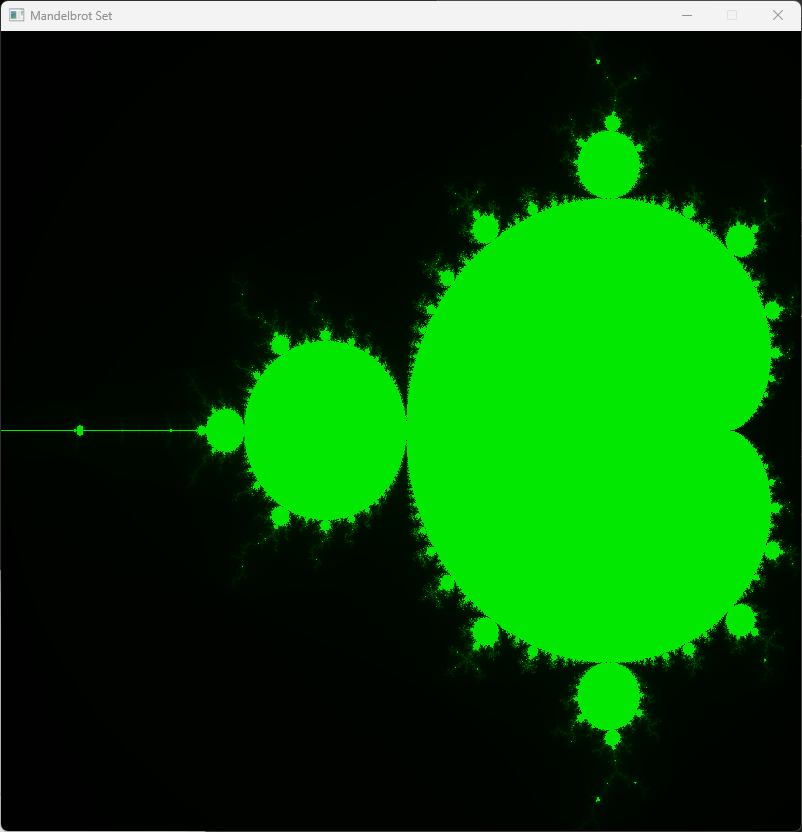

# Mandelbrot Set

## Wikipedia

https://en.wikipedia.org/wiki/Mandelbrot_set

```
for each pixel (Px, Py) on the screen do
    x0 := scaled x coordinate of pixel (scaled to lie in the Mandelbrot X scale (-2.00, 0.47))
    y0 := scaled y coordinate of pixel (scaled to lie in the Mandelbrot Y scale (-1.12, 1.12))
    x := 0.0
    y := 0.0
    iteration := 0
    max_iteration := 1000
    while (x*x + y*y ≤ 2*2 AND iteration < max_iteration) do
        xtemp := x*x - y*y + x0
        y := 2*x*y + y0
        x := xtemp
        iteration := iteration + 1
    
    color := palette[iteration]
    plot(Px, Py, color)
```

## Development Environment

- Microsoft Visual Studio Community 2022 (64-bit) - Preview
Version 17.6.0 Preview 6.0

- SFML 2.5.1 via vcpkg

## Usage

- R: Reset the view to 1:1 scale
- I: Zoom in around the center of the window
- O: Zoom out around the center of the window
- Arrow kyes: move the image
- Mouse left button click: move the mouse click point to the center of the window
- Mouse scroll up/down: zoom in/out anchored at the mouse cursor position

## Screenshot




